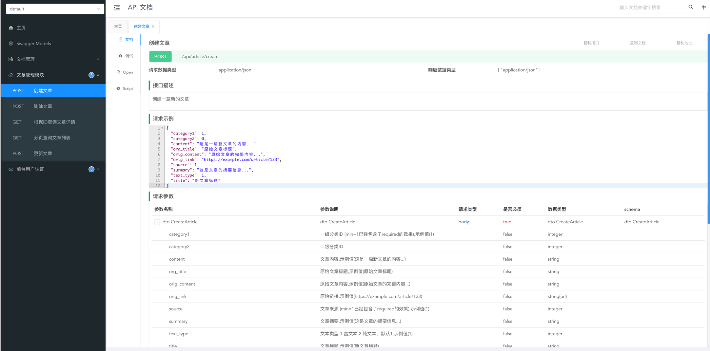

###

## 新手引导

第一次参与本项目开发，建议先看：

- [AGENTS.md](/Users/lchb/go_admin/gin-vue-admin/shop-api/AGENTS.md)
- [docs/new-developer-guide.md](/Users/lchb/go_admin/gin-vue-admin/shop-api/docs/new-developer-guide.md)
- [docs/codex-crud-guide.md](/Users/lchb/go_admin/gin-vue-admin/shop-api/docs/codex-crud-guide.md)
- [docs/module-crud-conventions.md](/Users/lchb/go_admin/gin-vue-admin/shop-api/docs/module-crud-conventions.md)
- [docs/architecture-dev-guide.md](/Users/lchb/go_admin/gin-vue-admin/shop-api/docs/architecture-dev-guide.md)

## 配置说明

```
配置文件在config目录中
dev,test,prod环境分别对应配置文件:
config-dev.yaml
config-test.yaml
config-prod.yaml
```

当前每个配置文件同时包含三种服务节点配置：

- `servers.mixed.port`：混合模式端口，同时提供 `/api` 和 `/admin-api`
- `servers.api.port`：前台 API 端口，只提供 `/api`
- `servers.admin_api.port`：后台 Admin API 端口，只提供 `/admin-api`

说明：

- `mount` 行为由入口写死，不再进入配置文件
- 监听 `ip` 默认统一使用 `0.0.0.0`
- 服务名默认按 `app.name + mode` 自动生成

入口与运行模式固定对应：

- `main.go`：默认运行 `mixed`
- `cmd/api/main.go`：强制运行 `api`
- `cmd/admin-api/main.go`：强制运行 `admin_api`

## 布署说明

1,开发语言:Go，需安装 Go 1.27.0 或更高版本
2,部署相关命令

``` shell
run,start,restart命令需要指定--env参数,以激活不同环境对应的配置文件

sh server.sh   #查看相关命令
sh server.sh run --env=prod   # 编译并运行混合模式，等效于(build->stop->start)
sh server.sh build            # 编译 mixed 入口
sh server.sh start --env=prod # 启动 mixed
sh server.sh stop             # 停止 mixed
sh server.sh restart --env=prod
```

也可以直接使用 Go 入口命令：

```shell
go run main.go -env=dev                  # mixed
go run cmd/api/main.go -env=dev          # api
go run cmd/admin-api/main.go -env=dev    # admin_api
```

### 数据库操作

所有 SQL 文件位于 `server-api/sql/`，文件名使用 `YYYYMMDD_序号_说明.sql`。当前目录只保留一个全量初始快照：`20260904_0001_init.sql`；它只包含建库、建表和初始数据，不包含删库或删表语句。

首次安装时，服务会在 `migrate.enable: true`（默认）且目标数据库不存在时自动执行 `sql/20260904_0001_init.sql`；数据库已存在时会跳过初始化，绝不会清空已有数据。服务随后照常执行 GORM 的结构迁移，并刷新该初始化快照。

配置项示例：

```yaml
migrate:
  enable: true
  sql-file: sql/20260904_0001_init.sql
```

将 `enable` 设为 `false` 可关闭首次初始化和启动后的 SQL 快照更新。

#### 手动初始化

```shell
# 仅用于数据库不存在的首次安装。
mysql -uroot -p123456 < sql/20260904_0001_init.sql
```

#### 手动更新初始化快照

`migrate` 命令会将当前配置连接的 MySQL 库完整导出、原子替换 `sql/20260904_0001_init.sql`。仅应对作为项目初始数据来源的开发库执行；命令依赖本机的 `mysqldump`。

```shell
sh server.sh migrate --env=dev
# 等效命令：go run ./cmd/migrate --env=dev
```

服务首次自动导入初始化快照以及手动导入均依赖本机 `mysql` 客户端。

### 正式环境布署

``` shell
#编译并重启服务
sh server.sh run --env=prod
```

### 测试环境布署

``` shell 
#编译并重启服务
sh server.sh run --env=test
```

### api文档
* 项目启动时会使用自已开发的文档系统。生成文档。
```shell
mixed 模式:
前端业务 API 文档: http://localhost:8800/api-doc/
后台 Admin API 文档: http://localhost:8800/admin-api-doc/

api 模式:
前端业务 API 文档: http://localhost:8801/api-doc/

admin_api 模式:
后台 Admin API 文档: http://localhost:8802/admin-api-doc/

```



### 管理后台
* 管理后台实现了对GinVueAdmin兼容。 接口进行了符合本项目代码规范的接口重构。

